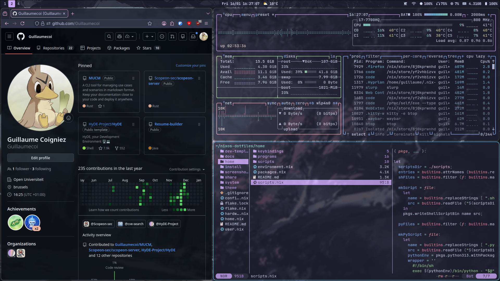
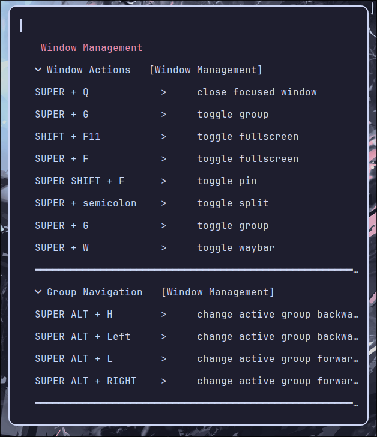
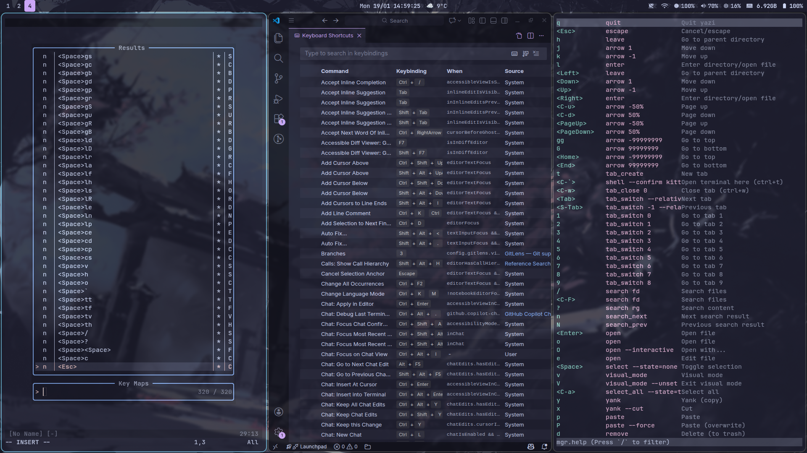
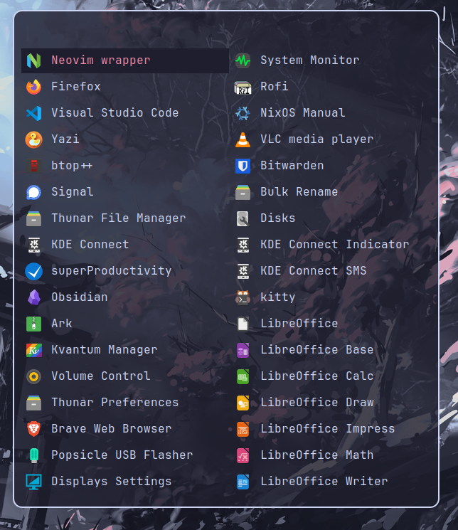
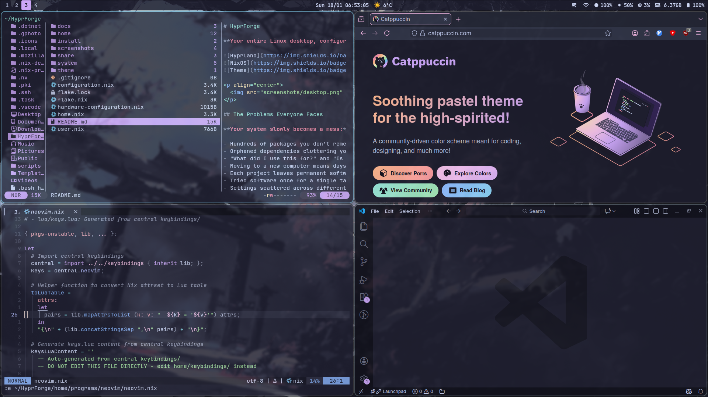
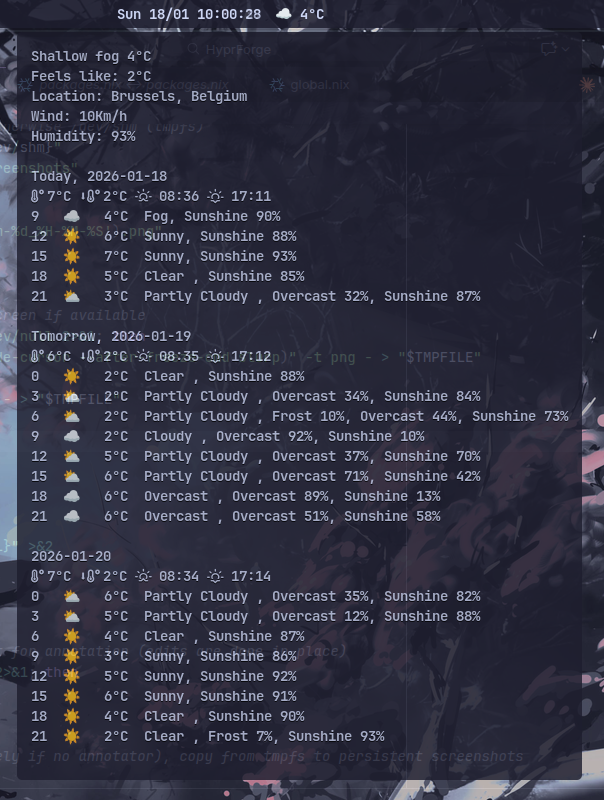
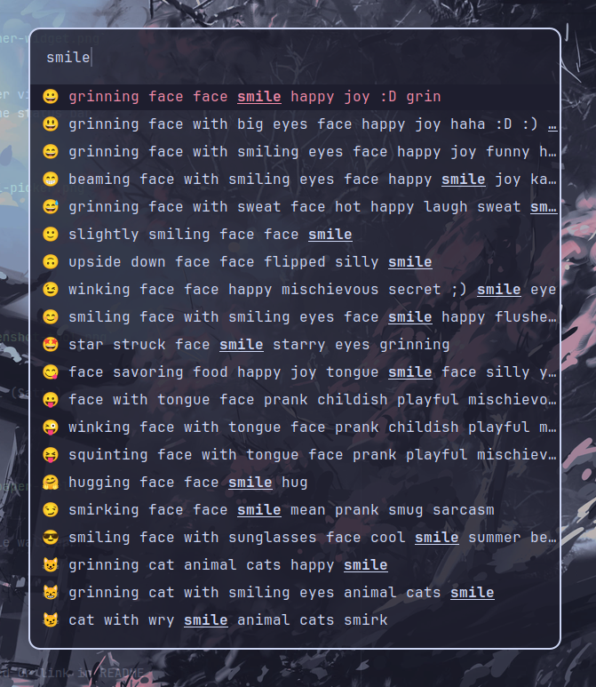

# HyprForge

**Your entire Linux desktop, configured and ready to use in one command.**


<p align="center">
  
</p>

## Why This Exists

Hyprland is an incredible tiling window manager, but it lacks essentials like a status bar, application launcher, or notification system. This configuration fills those gaps with a complete, polished desktop environment.

**More importantly:** Setting up a new PC used to take me 10+ hours of installing apps, configuring settings, and recreating keybindings. Now it takes 10 minutes. One command, and my entire workflow is ready to go. Same apps, same settings, same keybindings, every machine.

This also solves problems almost everyone struggles with but doesn't know there's a solution for: package bloat, scattered settings, forgetting what software you installed and why. Keep reading to see how.

## The Problems Everyone Faces

**Your system slowly becomes a mess:**

- Hundreds of packages you don't remember installing
- Orphaned dependencies cluttering your system
- "What did I use this for?" and "Is it safe to remove?"
- Moving to a new computer means days of reconfiguration
- Each project leaves permanent software you'll never use again
- Tried software once for a single task, now it's permanent bloatware
- Settings scattered across different machines, never quite right
- System backups include all your bloatware and mistakes
- RAM usage creeps up as forgotten background services accumulate
- Want to change a keybinding? Update it separately in 5+ different apps
- Mouse is slow, keyboard is fast, but you keep forgetting shortcuts

**Traditional solutions don't work.** Package managers track what you install but not _why_. Virtual machines are heavy. Containers don't solve system-level clutter. Reinstalling just resets the cycle.

## How This Configuration Solves Everything

### 1. **Complete System Transparency**

Your entire system is declared explicitly in two files: [`home/packages.nix`](home/packages.nix) (user apps) and [`system/packages.nix`](system/packages.nix) (system tools).

```nix
home.packages = [ firefox spotify gimp ];  # That's it. Everything you have.
```

No hidden dependencies. No mystery packages. Add one line to install. Delete one line to remove, completely, cleanly, no orphans.

### 2. **Effortless Migration & Reinstall**

Moving to new hardware or need to reinstall? **Your system is installed in 10 minutes with all your apps and settings.**

```bash
# New machine: One command
sudo bash -c "$(curl -fsSL https://raw.githubusercontent.com/GuillaumeCoi/HyprForge/main/install/install.sh)"
# All apps, all settings, perfectly restored
```

Your system configuration is version-controlled. Reinstalling becomes trivial.

### 3. **One-Time Software Without Bloat**

Need to convert a video once? Extract an archive in a weird format? **Traditional approach:** Install the tool, use it once, forget about it. Now it's permanent bloatware.

**With nix-shell:**

```bash
nix-shell -p imagemagick --run "convert image.jpg image.png"
# Used once. Gone forever. Zero system footprint.
```

Try any software instantly without installing it. Your system stays pristine.

### 4. **Project-Specific Software, Zero System Impact**

Need Python 3.9 for one project and Python 3.11 for another? Need CAD software only for specific work? **Use dev templates:**

```bash
# Go to your project folder
cd my-python-project

# Copy the template you want
cp ~/HyprForge/dev-templates/python/*

# Edit shell.nix to add/remove the software you want

# Then use direnv to activate the new environnement
direnv allow
```

**Delete the project → all its software automatically gone.** No system pollution. No conflicts between project requirements. Perfect for:

- Reproducible development environments (everyone gets identical tool versions)
- Project-specific software you don't want system-wide
- Different versions/settings of the same program per project
- Keeping your system clean when projects end

### 5. **Perfect Settings, Every Computer**

Configure an app once. That configuration is in your dotfiles. **Move to a new machine?** Clone your repo and run one command. Your keybindings, theme, layouts, everything identical in seconds.

No more "how did I configure this on my other laptop?" No more inconsistent setups. Your perfect environment follows you everywhere.

### 6. **Performance That Lasts**

Traditional computers slowly accumulates running services, background processes, and startup items you forgot about. **RAM usage creeps up. Boot times increase.**

With this setup, if it's running, it's in your config. You see it. You control it. Your system stays as fast as day one because nothing accumulates invisibly.

### 7. **Backup Only What Matters**

Traditional backup: 50GB snapshot with every app, bloatware, malware, mistakes included.

**NixOS backup:** Your config files (a few MB) + your data. That's it. Restore on any machine, get a **clean** system with only what you actually want.

### 8. **Centralized Keybindings: Change Once, Update Everywhere**

Want to change `Ctrl+T` to `Ctrl+N` for new tabs? **Traditional approach:** Edit Kitty config, Firefox shortcuts, VS Code settings, Neovim mappings, Yazi config separately, 5+ files!

**This setup:** Change one line in `home/keybindings/local.nix`, run `homeswitch`. This automatically updates across every configured app.

```nix
# One change here...
tabs = {
  new = "ctrl+n";
  ...

# Updates Kitty, Firefox, VS Code, Neovim, Yazi... automatically
```

Perfect consistency without the maintenance burden.

### 9. **Keyboard Shortcuts Without the Memory Game**

**The problem:** Keyboard shortcuts are faster than the mouse, but you keep forgetting them. So you fall back to slow mouse navigation.

**The solution:** Press `SUPER + F1` anytime to see a beautiful popup of all your global shortcuts, categorized, **searchable**, always available.

<p align="center">
  
  <br/>
  <em>Never forget a shortcut again. SUPER + F1 shows your complete keybinding reference.</em>
</p>

No more digging through documentation. No more "how do I...?" moments. Your shortcuts are always one keypress away.

Also available: per-app shortcut hints. Press `CTRL + F1` while focused in a supported application to see that app's shortcuts (searchable and categorized).

<p align="center">
  
  <br/>
  <em>App-local shortcuts: press CTRL + F1 to view shortcuts for the focused app.</em>
</p>

---

**Additional features:**

- **160+ curated packages** - Ready to uncomment, no hunting for package names
- **Unified theming** - Catppuccin Mocha across every application
- **Custom utilities** - Weather widget, emoji picker, screenshot tools

<p align="center">
  
</p>

## Visual Consistency: One Theme Everywhere

Lots of applications use the same **Catppuccin Mocha** color palette out of the box:

<p align="center">
  
</p>

- Terminal matches your editor
- File manager matches your browser
- Status bar matches your notifications
- Even Firefox follows the theme

No more jarring switches between dark and light apps. Everything just looks right together.

## Custom Utilities Built In

<table>
<tr>
<td width="50%">

**Weather in Status Bar**

Real-time weather display with forecast, right in Waybar.



</td>
<td width="50%">

**Emoji & Symbol Picker**

`SUPER + ,` for emoji, `SUPER + .` for glyphs. Search and insert anywhere.



</td>
</tr>
<tr>
<td>

**Screenshot Tools**

`SUPER + P` to snip, `SUPER + SHIFT + P` for color picker. Annotate with Satty.

</td>
<td>

**Wallpaper Rotation**

`SUPER + SHIFT + W` cycles through wallpapers with smooth transitions.

</td>
</tr>
</table>

## What's Included

Curated list of 160+ popular applications across all categories. **Just uncomment what you want in `home/packages.nix`** - no hunting for package names:

You can choose how each app is delivered: install native Nix packages for better performance and tighter system integration, or use Flatpaks for stronger sandboxing and isolation (better security and reproducibility). Both options are configured in `home/packages.nix`: native packages are collected in the `nixPackages` list, and Flatpaks are listed in the `flatpakPackages` list (Flatpaks are installed via Flatpak when `home-manager` activates).

```nix
nixPackages = [
  # Browsers
  firefox          # Pre-configured with extensions
  # brave          # Uncomment to install
  # chromium       # Easy to add/remove

  # Communication
  discord
  # slack          # Comment out to remove
  # zoom           # One line = one app
];

flatpakPackages = [
  "com.usebottles.bottles"
  "com.github.tchx84.Flatseal"
  # "com.spotify.Client"              # Comment out to add spotify
];
```

| Category            | Examples                                                |
| ------------------- | ------------------------------------------------------- |
| **Configured Apps** | Hyprland, Kitty, Neovim, VS Code, Firefox, Yazi, Waybar |
| **Dev Tools**       | Git, Docker, Podman, 7 language templates               |
| **Productivity**    | LibreOffice, Obsidian, Zathura, TaskWarrior             |
| **Media**           | VLC, mpv, ffmpeg, ImageMagick, OBS                      |
| **Communication**   | Signal, Telegram, Discord, Element                      |

## Why This Approach Works: Two Files, Total Control

Traditional Linux systems accumulate packages over time. After a few years, you have 800+ packages and no idea which ones matter. Libraries you don't recognize. Services you forgot about. RAM usage creeping up.

**This configuration makes everything explicit:**

#### `home/packages.nix` - All Your Programs

```nix
home.packages = with pkgs; [
  spotify obsidian gimp vlc
  # Add one line to install
  # Delete one line to remove completely
];
```

#### `system/packages.nix` - System Tools

```nix
environment.systemPackages = with pkgs; [
  git docker htop
];
```

**Two files. That's your entire system.** No hidden dependencies. No mystery packages. Want to add something? One line. Want to remove? Delete the line. It's gone completely, no orphaned dependencies.

Years later, your system stays as clean as day one because nothing accumulates invisibly.

## Quick Start

### Fresh Install (New Machine)

Boot from NixOS USB, connect to internet, then:

```bash
sudo bash -c "$(curl -fsSL https://raw.githubusercontent.com/GuillaumeCoi/HyprForge/main/install/install.sh)"
```

The script prompts for:

- Target disk
- Swap size
- Username & hostname
- NVIDIA GPU (yes/no)
- Git name & email

Then it installs everything automatically.

**[Detailed install guide →](install/README.md)**

### Existing NixOS System

```bash
git clone https://github.com/GuillaumeCoi/HyprForge.git ~/HyprForge
cd ~/HyprForge

# Copy example files and customize for your machine
cp user.nix.example user.nix
cp hardware-configuration.nix.example hardware-configuration.nix
cp home/home-config.nix.example home/home-config.nix
cp home/packages.nix.example home/packages.nix

# Edit configuration files
nano user.nix              # System: hostname, username, hardware settings
nano home/home-config.nix  # User: git config, monitor settings
nano home/packages.nix     # Add/remove packages you want

# Generate your actual hardware config
sudo nixos-generate-config --show-hardware-config > hardware-configuration.nix

# IMPORTANT: Add gitignored files to git index (required for flakes)
# They won't be committed due to .gitignore, but flakes need them in the index
git add -f user.nix home/home-config.nix home/packages.nix

# Apply the configuration
sudo nixos-rebuild switch --flake .#YOUR_HOSTNAME
```

## Dev Templates: Isolated Development Environments

**Project-specific tools without system-wide installation:**

```bash
cd my-python-project
nix-shell ~/HyprForge/dev-templates/python
# Python + pip + virtualenv instantly available
# Only in this directory
```

Included templates: Python, Rust, C++, JavaScript, Java, Pentesting, CAD/Hardware

**Leave the directory → tools vanish.** Perfect isolation. Zero system clutter.

## Customization

**Modify anything easily:**

### Add/Remove Programs

Edit [home/packages.nix](home/packages.nix) or [system/packages.nix](system/packages.nix):

```nix
home.packages = with pkgs; [
  spotify    # Add this line
  # slack    # Comment out to remove
];
```

### Change Keybindings or Settings

[home/keybindings/](home/keybindings/) controls all configured apps:

```nix
# Change once, updates everywhere
"ctrl+shift+t" = { category = "tabs"; description = "Reopen tab"; };
```

### Change Default Apps

[home/keybindings/apps.nix](home/keybindings/apps.nix):

```nix
terminal = "kitty";   # or "alacritty"
editor = "code";      # or "nvim"
browser = "firefox";  # or "brave"
```

After any change: `sudo nixos-rebuild switch`

## Project Structure

```
HyprForge/
├── flake.nix              # Entry point
├── user.nix               # Your machine settings
├── configuration.nix      # System config
├── home.nix               # User environment
│
├── home/
│   ├── packages.nix       # ← ALL your user programs (file 1 of 2!)
│   ├── keybindings/       # Centralized keybindings & settings
│   │   ├── global.nix     # Window manager (SUPER key)
│   │   ├── local.nix      # Apps (CTRL/ALT)
│   │   └── apps.nix       # Default applications
│   ├── programs/          # ← Apps WITH home-manager configs
│   │   ├── hyprland/      #   (auto-applied settings)
│   │   ├── kitty/
│   │   ├── neovim/
│   │   ├── vscode/
│   │   └── ...
│   └── scripts/           # Custom utilities
│
├── system/
│   └── packages.nix       # ← ALL system packages (file 2 of 2!)
│
├── dev-templates/         # Isolated dev environments
│   ├── python/
│   ├── rust/
│   ├── javascript/
│   └── ...
│
├── theme/
│   └── theme.nix          # Catppuccin colors
│
└── docs/                  # Full documentation
```

## Requirements

- x86_64 machine with UEFI boot
- 20GB+ disk space
- Internet connection

## Documentation

- **[Installation Guide](install/README.md)** - Detailed setup instructions
- **[Usage Guide](docs/USAGE.md)** - How to customize and manage your system
- **[Package List](docs/PACKAGES.md)** - All 160+ available packages
- **[Keybindings](docs/KEYBINDINGS.md)** - Complete keybinding reference
- **[Architecture](docs/ARCHITECTURE.md)** - How HyprForge works internally
- **[FAQ](docs/FAQ.md)** - Frequently asked questions
- **[Troubleshooting](docs/TROUBLESHOOTING.md)** - Common issues and solutions

## Use This

Fork it. Study it. Steal from it. The centralized configuration system and dev templates are worth exploring for your own setup.

This is my personal config, structured to be readable, modular, and maintainable. **The 2-file package management alone will change how you think about Linux systems.**

## License

MIT - Use however you want.

---
